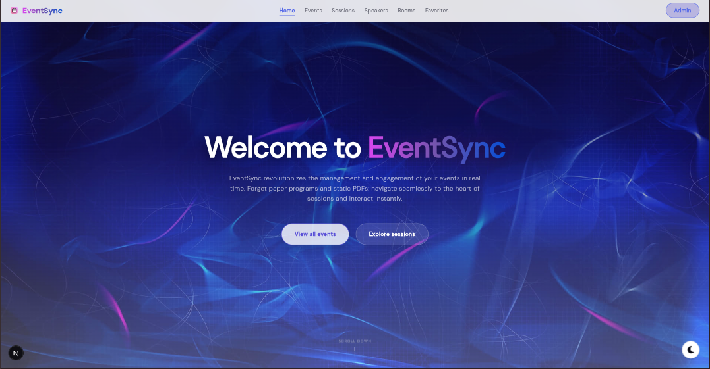
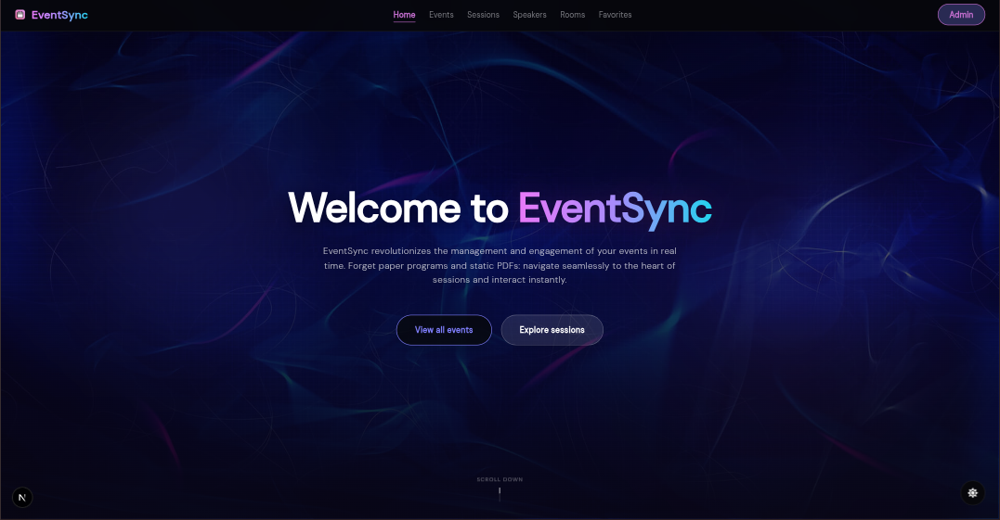
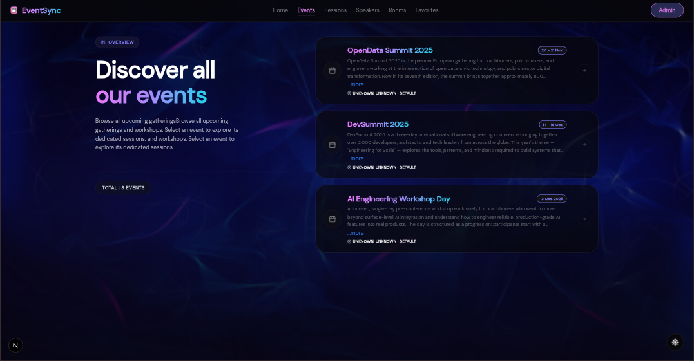
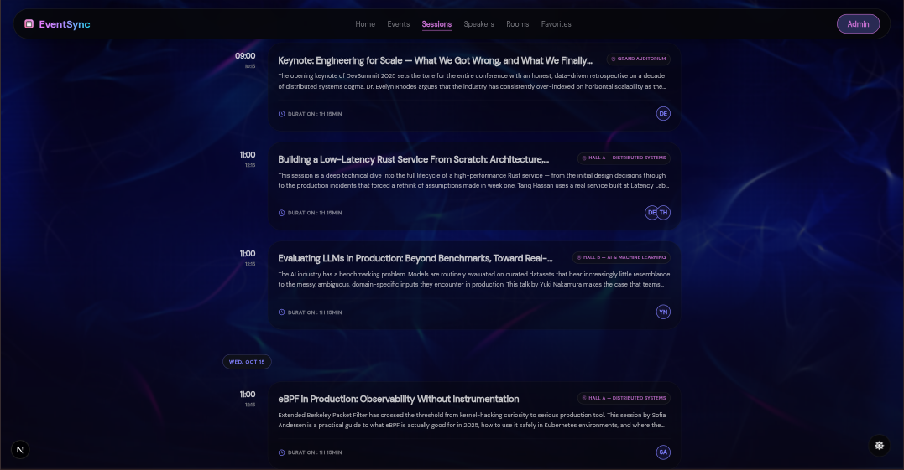
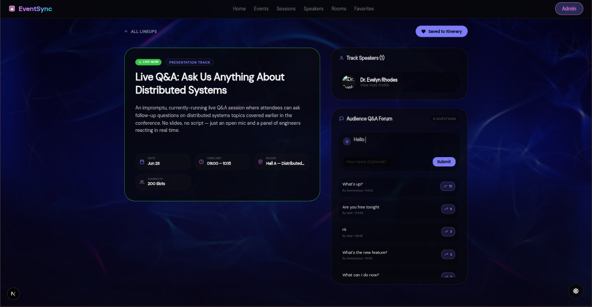
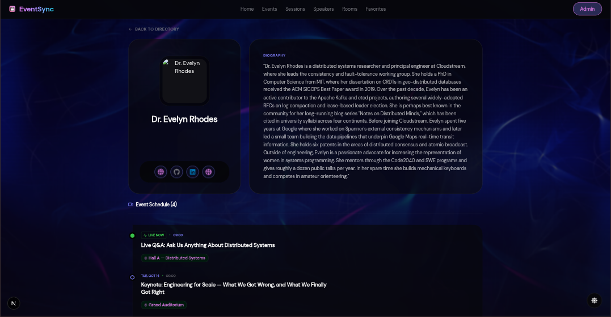
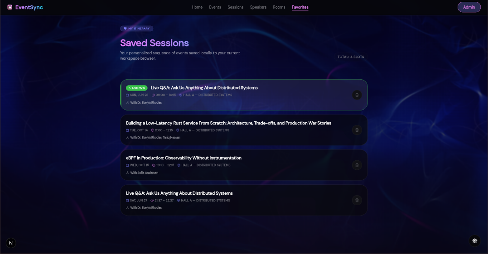

# EventSync

> A real-time event management and attendee engagement platform.

EventSync replaces static event materials (PDFs, printed programs) with a dynamic web experience for navigating events and interacting with sessions as they happen.

<p align="center">
  
</p>
<p align="center">
  
</p>

<p align="center">
  
  
  
  
</p>

---

## Table of Contents

- [Overview](#overview)
- [Tech Stack](#tech-stack)
- [Application visuals](#application-visuals)
- [User Roles](#user-roles)
- [Features](#features)
- [Getting Started](#getting-started)

---

## Overview

EventSync is built for three audiences:

- **Organizers**, who manage events, sessions, rooms, and speakers from an authenticated admin space.
- **Attendees**, who browse events publicly, follow the live schedule, and interact with ongoing sessions.
- **Speakers**, who get an automatically generated public profile page showcasing their sessions and the questions asked during them.

The platform's centerpiece is a **live Q&A system**: while a session is in progress, attendees can submit questions and upvote existing ones, all sorted in real time by popularity.

## Tech Stack

| Layer      | Technology              |
|------------|-------------------------|
| Frontend   | Next.js, TypeScript     |
| Backend    | Next.js (API Routes)    |
| Styling    | Tailwind CSS            |
| Storage    | Browser local storage (favorites, upvotes) |

## Application visuals

> Here are some overview of our application

### Event Page

<p align="center">
  
</p>

### Multi-Track Schedule

<p align="center">
  
</p>

### Session Detail & Live Q&A

<p align="center">
  
</p>

### Speaker Page

<p align="center">
  
</p>

### Favorites Page

<p align="center">
  
</p>

## User Roles

### 🛠️ Organizer (Admin)

Secured access via authentication.

- Create, edit, and delete events
- Manage sessions (creation, editing)
- Assign speakers to sessions
- Define rooms and time slots
- Manage speaker profiles

### 👥 Attendee (Public Access)

Open access, no authentication required.

- Browse events
- View the full schedule
- Identify sessions currently live
- Access session details
- Ask questions during a live session
- Upvote questions
- Bookmark sessions as favorites

### 🎤 Speaker

No dedicated authentication system.

- Access their public page
- View the sessions they're part of
- See the questions asked on their sessions

## Features

### 📌 Event Page

Public page displaying an event's title, description, dates, and session list, with currently live sessions highlighted.

### 🗓️ Multi-Track Schedule (Global View)

Sessions displayed as a time-based grid:

- Organized by time slot
- Simultaneous sessions shown side by side, grouped by room
- Each entry shows title, time, room, and speakers
- Actions: open session detail, add session to favorites

### 🔴 Live Session Detection

A session is automatically flagged as **live** when the current time falls between its start and end time. The "Live" badge appears on the event page, the global schedule, and the per-room view.

### 📄 Session Detail Page

Displays title, description, time slot, room, capacity (informative), the list of speakers (linked to their pages), and the Q&A section.

### 💬 Live Q&A System

- **Visibility**: only available while the session is live; hidden before it starts
- **Submission**: required text field, optional name field (anonymous allowed)
- **Listing**: questions sorted by upvote count, descending
- **Upvoting**: attendees can upvote existing questions; each upvote increments a counter

### 🎤 Speaker Pages

Automatically generated, publicly accessible pages showing profile picture, name, bio, external links, and the speaker's associated sessions.

### 🏛️ Room Schedule View

Chronological list of sessions for a given room, showing time, title, speakers, and the "Live" badge when applicable.

### ⭐ Favorites (Personal Itinerary)

Attendees can build a personal session selection:

- Add a session to favorites
- Remove a session from favorites
- View the full favorites list

Favorites are stored client-side, in the browser.

## Getting Started

```bash
# Clone the repository
https://github.com/organigrammeuh/eventy-sinky.git
cd eventy-sinky

# Install dependencies
npm install

# Run the development server
npm run dev
```

The app will be available at `http://localhost:3000`.

---

<p align="center">Built with Next.js, TypeScript, and Tailwind CSS.</p>
